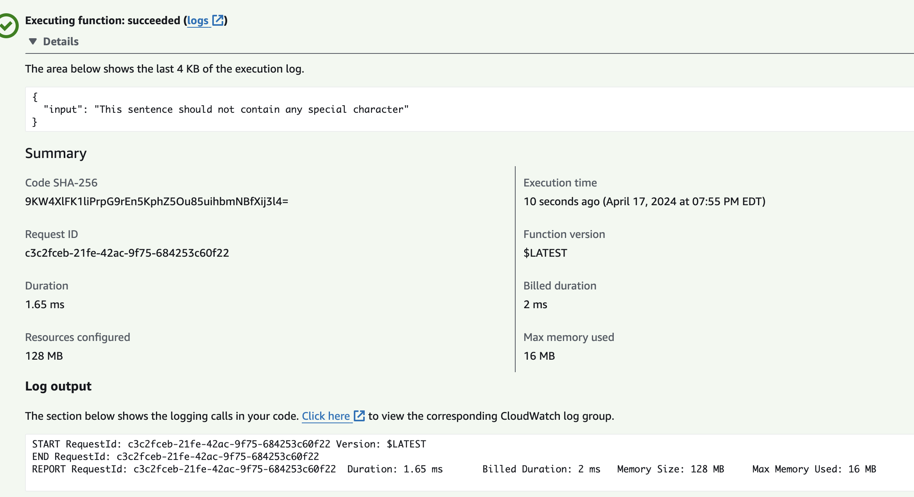
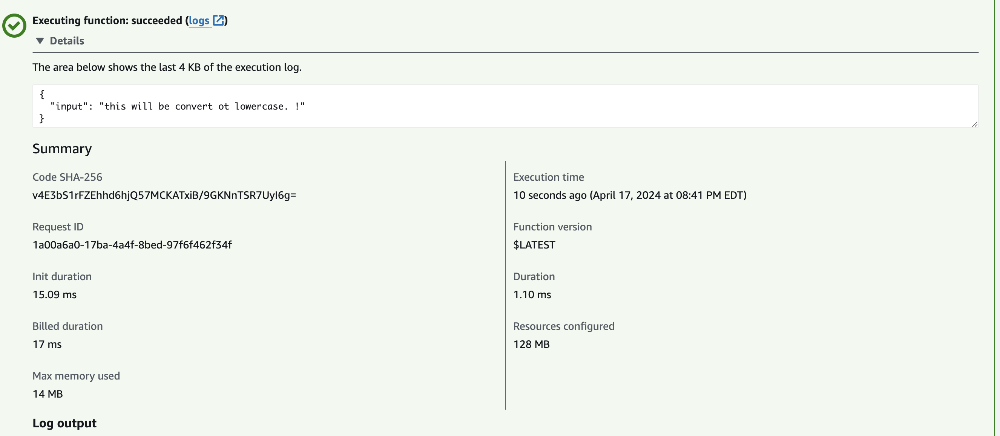
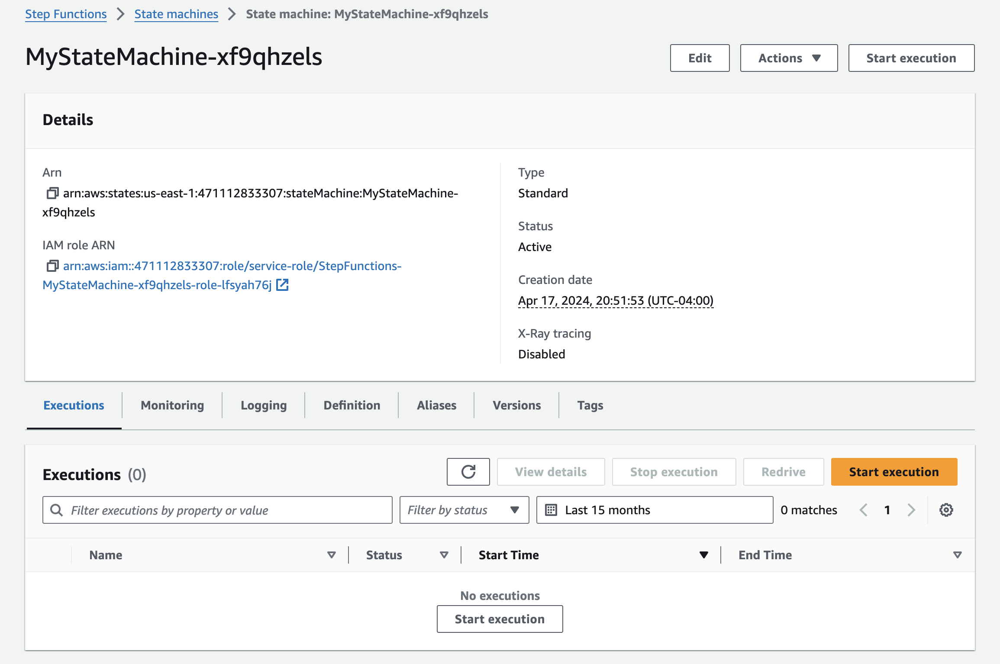
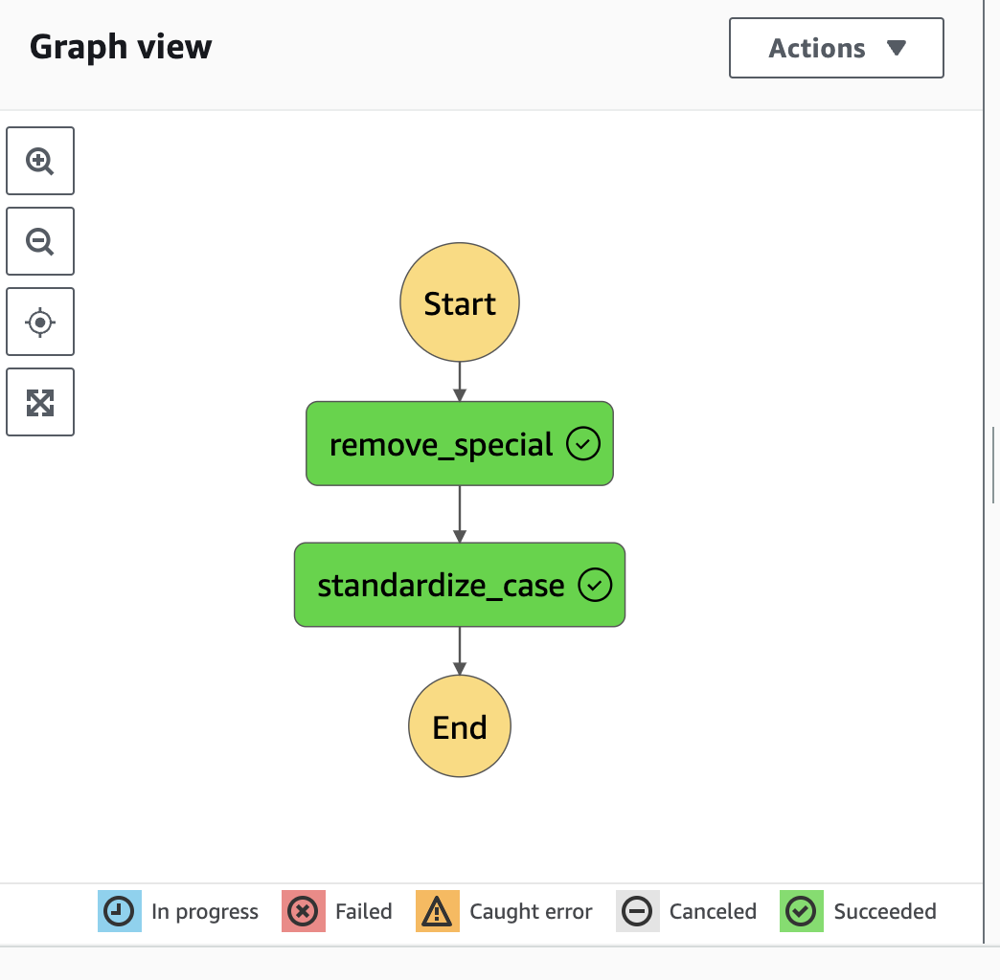
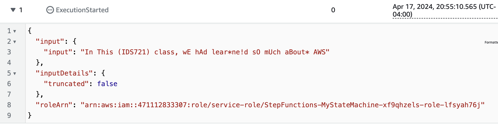
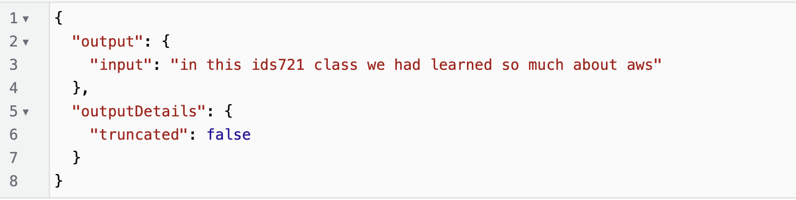

# IDS 721 Individual Project 4: Rust AWS Lambda and Step Functions
- Rust AWS Lambda function
- Step Functions workflow coordinating Lambda
- orchestrate data processing pipeline

## Description: 
This project is a simple data processing pipeline that orchestrates a Lambda function and Step Functions workflow, one function remove all special characters from the input text, one function lowercases the text.

For example: `This is **a** test.`, will be processed to `this is a test`.
## Requirement
- Rust, Cargo lambda

## Set up

- Create the Rust Lambda functions using `cargo lambda new name_of_function`
- Build, deploy the function to AWS Lambda using:
    -  `cargo build --release --arm64`
    -  `cargo lambda deploy --iam-role arn:aws:iam:yourAcountNumber:role/yourRole`
- Test each lambda function locally or on AWS lambda:


- Create a Step Functions workflow using the AWS console with this code:
```Json
{
  "Comment": "My state machine will transform text into lowercase and remove all special characters that can later be used for NLP",
  "StartAt": "remove_special",
  "States": {
    "remove_special": {
      "Type": "Task",
      "Resource": "arn:aws:lambda:us-east-1:471112833307:function:remove_special",
      "Next": "standardize_case"
    },
    "standardize_case": {
      "Type": "Task",
      "Resource": "arn:aws:lambda:us-east-1:471112833307:function:standardize_case",
      "End": true
    }
  }
}
```


- Execute the workflow with the following input: 



- Set up CI with `.gitlab-ci.yml`.


## Data Processing Pipeline
1. remove_special: gets input text and removes all special characters. It returns the output text without special characters. The output is represented in JSON format.
2. standardize_case: gets input text and lowers the case. It returns the output text in lowercase. The result is represented in JSON format.

